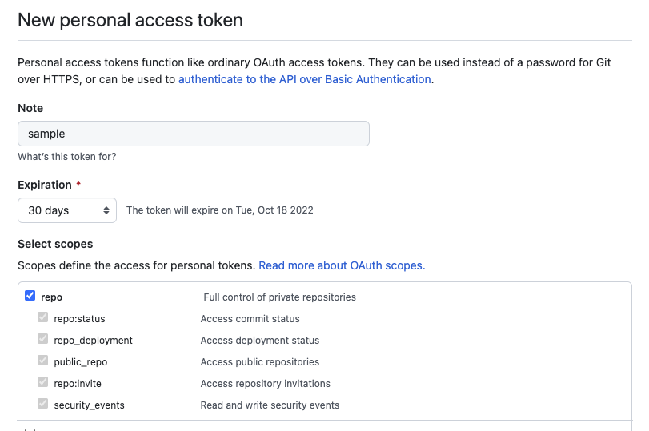

## 프로젝트 소개
Github GraphQL API + Relay 를 활용한 레포지터리 검색기

## 실행방법

### 1. Github Personal Access Token 발급


Github API 사용을 위한 개인 액세스 토큰을 발급 받아 복사합니다.

### 2. Github Personal Access Token 세팅

복사해둔 토큰을 프로젝트 <code>Root</code> 폴더 아래 <code>.env</code>
파일을 생성해 <code>NEXT_PUBLIC_GITHUB_TOKEN</code> 변수로 세팅해주세요.

```bash
touch .env
echo NEXT_PUBLIC_GITHUB_TOKEN=발급받은_토큰 >> .env
```

### 3. 패키지 설치
```bash
npm install
# or
yarn
```

### 4. 실행
아래 명령어를 통해 프로젝트 로컬환경으로 실행합니다.
```bash
npm run dev
# or
yarn dev
```

### 5. 접속경로
```bash
http://localhost:3000 (기본포트 3000)
```
***


```markdown
연락이 필요하시면 아래 이메일을 이용해주세요.

작성자: 임찬수
이메일: <cslim0527@gmail.com>
```
